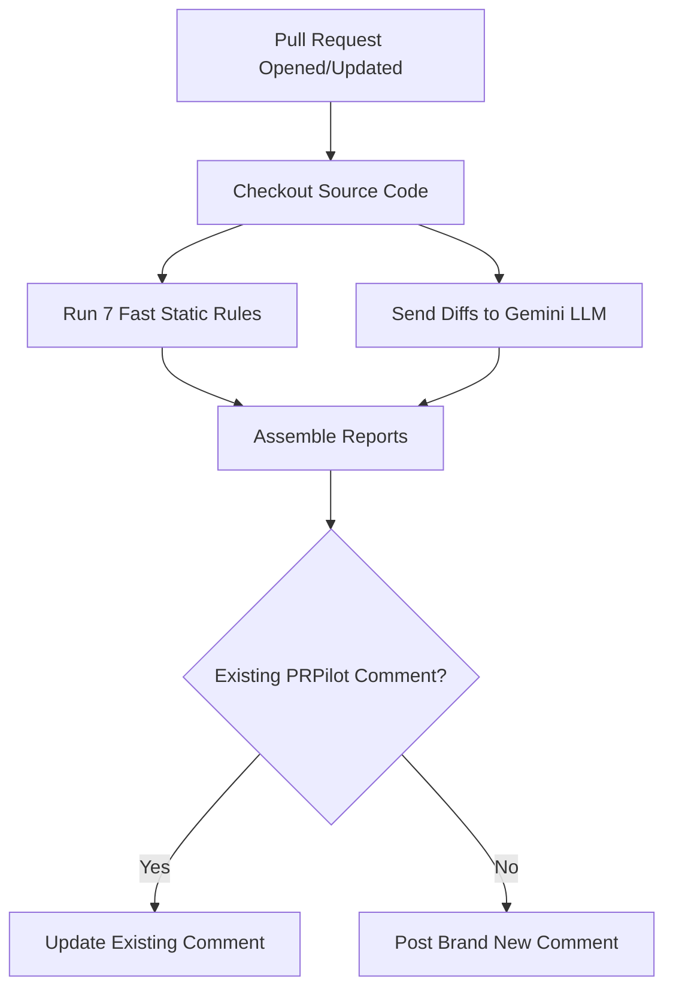

# **PRPilot**

### **Automate your code reviews with ultra-fast static checks and smart AI suggestions from Google Gemini.**

[](https://github.com/Talha12Shiekh/prpilot/actions)
[](https://github.com/Talha12Shiekh/prpilot/releases)
[](https://opensource.org/licenses/MIT)
---

## **Table of Contents**
1. [Core Features](#core-features)
2. [Installation](#installation)
3. [Configuration & Usage](#configuration--usage)
4. [How it Works](#how-it-works)
5. [Contributing](#contributing)
6. [License](#license)

---

## **Core Features**

PRPilot analyzes your code diffs and commit history during every Pull Request. It is unique because it integrates **two layers of analysis**:

- ⚡ **Hybrid Review Engine**: Combines the precision of deterministic static linting rules with the reasoning capability of LLMs (Google Gemini 2.5).
- 🔍 **7 Built-in Static Rules**:
  - **Secrets Leak Prevention**: Scanning for exposed keys, passwords, and sensitive environment variables.
  - **TODO Scanner**: Flags incomplete task markings left in the changes.
  - **Debug Log Check**: Prevents temporary diagnostic console output from slipping into production.
  - **Large PR Alert**: Warns developers when a review includes too many modifications.
  - **Missing Tests detection**: Intelligently searches modified files for associated testing coverage.
  - **Conventional Commits validation**: Validates commit logs to enforce structured release histories.
  - **Dependency Verification**: Inspects package manifest changes to flag potentially insecure installation patterns.
- 💡 **Contextual AI Suggestions**: Hands-on advice directly generated by Google Gemini to improve performance, readability, and logic flow.
- 💬 **Anti-Spam Comment Threading**: Automatically finds its previous review comment on the PR and updates it in place instead of cluttering your inbox.

---

## **Installation**

To add PRPilot to your repository, simply create a new workflow file at `.github/workflows/prpilot.yml` and paste the following content:

```yaml
name: "PRPilot AI Reviewer"

on:
  pull_request:
    types: [opened, synchronize, reopened]

jobs:
  review:
    runs-on: ubuntu-latest
    permissions:
      contents: read
      pull-requests: write # Required to allow PRPilot to post comments on your PR

    steps:
      - name: Checkout Code
        uses: actions/checkout@v4

      - name: Run PRPilot
        uses: Talha12Shiekh/prpilot@main
        with:
          github-token: ${{ secrets.GITHUB_TOKEN }}
          api-key: ${{ secrets.GEMINI_API_KEY }}
```

---

## **Configuration & Usage**

### **Setting Up the Gemini API Key**
PRPilot requires a Google Gemini API Key to generate code review suggestions. You can acquire a free key in [Google AI Studio](https://aistudio.google.com/).

1. Go to your repository settings on GitHub.
2. Select **Settings** > **Secrets and variables** > **Actions**.
3. Create a **New repository secret**.
4. Set the name to `GEMINI_API_KEY` and paste your key.

### **The Output**
Once the action completes, PRPilot will write its review directly to the PR's comment section.

**If all checks pass:**
> ### PRPilot Review: All Checks Passed!
> 
> Good work! No issues were detected.

**If issues are detected (Static Rules or AI suggestions):**
> ### PRPilot Review: Issues Detected
> 
> Things that might need your attention before merging:
> 
> #### Debug Logs Found
> - Console log found in `src/index.ts:20`
> 
> #### AI Code Review Suggestions
> - In `src/github.ts`, consider adding a retry mechanism or error handling for the `getPRMetadata` call to prevent failures if GitHub API is rate limited.
> 
> ---
> *Auto-generated by [PRPilot](https://github.com/Talha12Shiekh/prpilot)*

---

## **How it Works**



---

## **Contributing**

We love community contributions! To get started:
1. Fork this repository.
2. Create a feature branch: `git checkout -b feature/my-new-rule`.
3. Add your changes and compile the bundle locally: `npx.cmd npm run build` (or `npx ncc build src/index.ts -o dist`).
4. Commit your changes and open a Pull Request.

---

## **License**

This project is licensed under the [MIT License](LICENSE) - see the [LICENSE](LICENSE) file for details.
